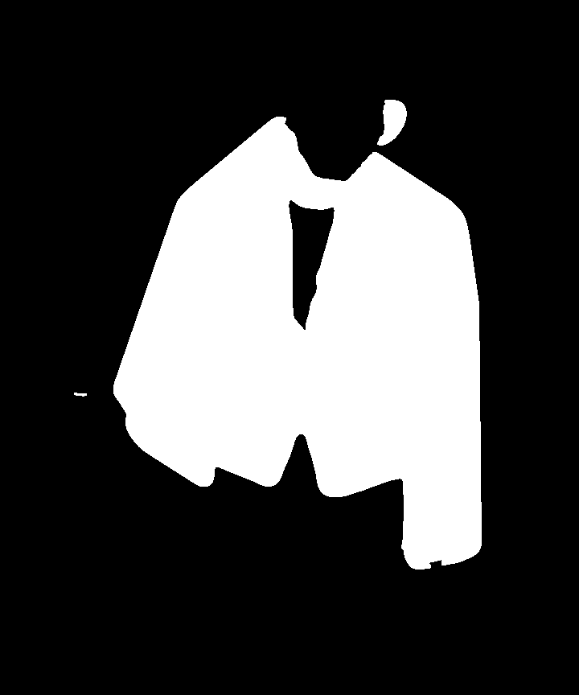

# omoib-ai

## 이 레포지토리의 목적 / Purpose of this Repository  
- 사용자의 전신 이미지의 마스킹 이미지를 생성하는 태스크를 AWS Lambda 함수 위에서 동작할 수 있도록 최적화한 레포지토리  
- This repository is optimized to run tasks for generating masked images of full-body user photos on AWS Lambda functions.  

---

## 로컬 환경에서 실행 방법 / how to run in local environment  
1. `pip install -r requirements.txt`  
2. `python agnostic_mask.py`  

---

## 워크플로우 / Workflow  
  

> - 사용자의 이미지를 입력받음  
> - 서버에서 Lambda 함수를 호출함  
> - `get_mask` 메서드가 `upper`, `lower`, `overall`, `inner`, `outer` 키워드를 순회하면서 5장의 마스킹 이미지를 생성함  
> - 생성 결과는 S3에 저장되고 완료 메시지가 SQS에 저장됨  

> - Accepts user images as input  
> - Calls the Lambda function from the server  
> - The `get_mask` method iterates through the keywords `upper`, `lower`, `overall`, `inner`, and `outer` to generate 5 masked images  
> - The results are saved in S3, and a completion message is stored in SQS  

## 인퍼런스 결과 / Inference Reuslt
### Input
  

### Result
  